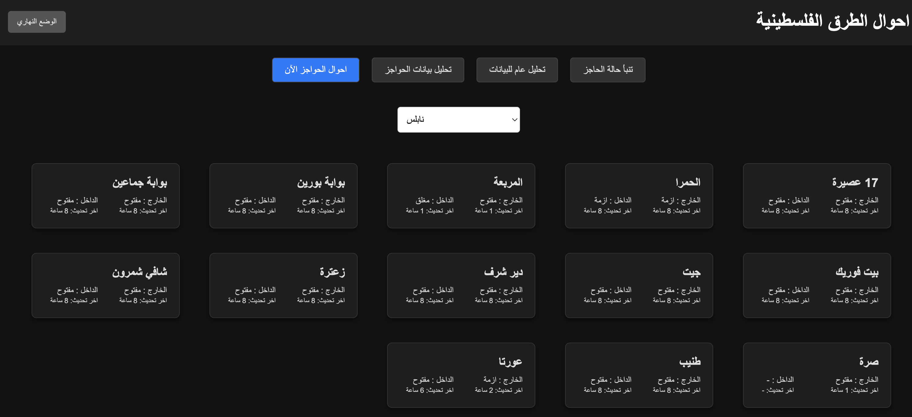
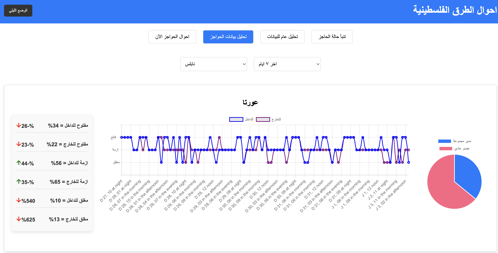
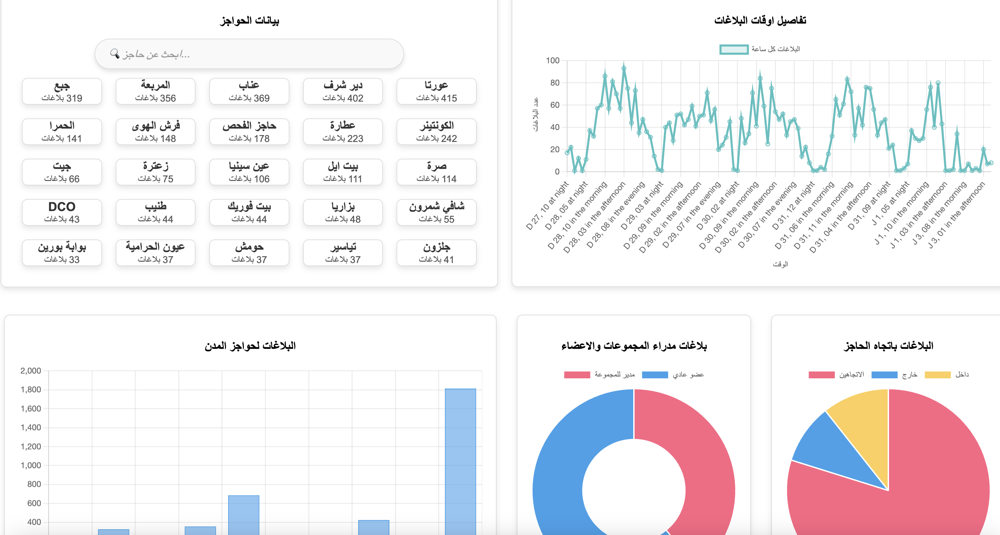
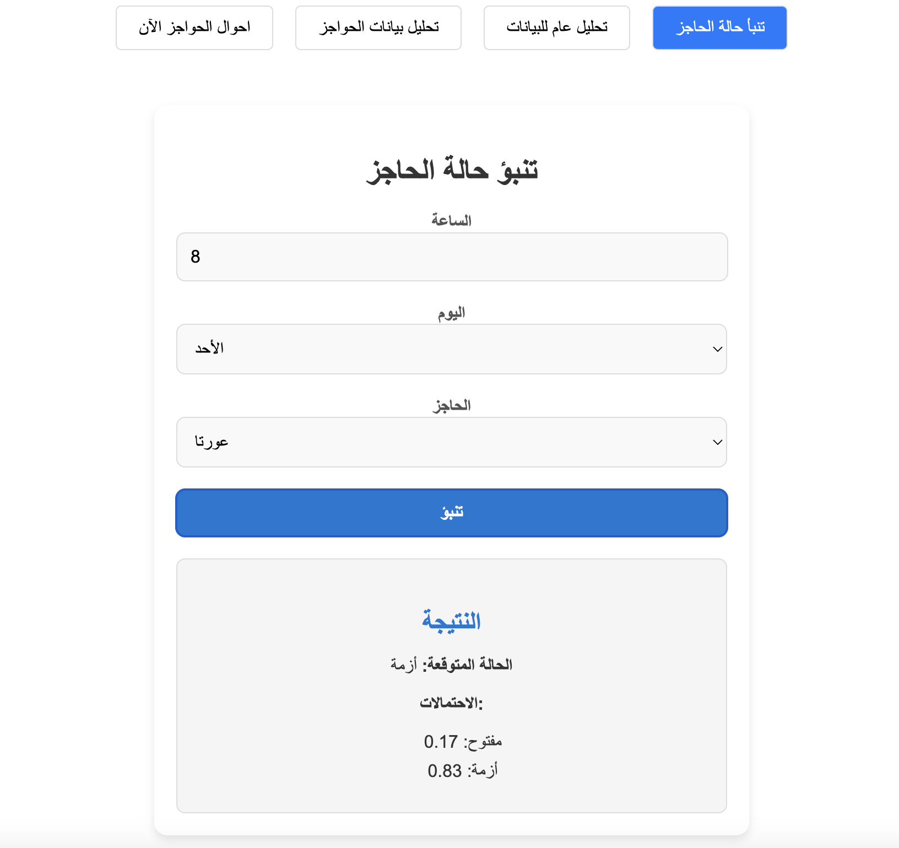

# Palestine checkpoint conditions
This project focuses on studying and analyzing checkpoint conditions by processing a live stream of user reports from a set of predefined Telegram groups. A Kafka server is used to manage the data stream, while Spark Structured Streaming consumes the Kafka messages, aggregates the data, and stores it in Mongo DB. A front-end application is then employed to visualize the latest status, provide insights based on historical data, and display predictions generated by a trained model using past data.

You can get the current Checkpoint status (Dark or Light mode for all views in the app)

You can have time analysis for a specific checkpoint status, and some summarization with trend analysis

You can focus on insights related to reports themselves

Finally, you can predict a checkpoint status

## Setup kafka server and topics
First download kafka and start the server and zookeeper.

The project has 2 topics 'road-structured-messages' and 'road-raw-messages', you will need to create them using the below commands:

- `./kafka-topics.sh --create --topic road-raw-messages --bootstrap-server localhost:9092 --partitions 4`
- `./kafka-topics.sh --create --topic road-structured-messages --bootstrap-server localhost:9092 --partitions 4`

## Setup Mongodb
Install mongosh and create a database 'RoadsConditions' and 3 collections 'StructuredData', 'CheckpointAggregation' and 'AggregationCount'

## Start the consumers
Open the [RoadsConditionsPipeline](./RoadsConditionsPipeline/) project in intellji, it already has run configuration, make sure to create a checkpoint directory and replace the args in the project to your paths:
- Make sure to edit bloom filter and checkpoint path for RawRoadDataConsumer, and only checkpoint path for StructuredMessagesAggregator

Or submit them as spark jobs (change the path to yours), you can generate the jar using sbt assembly or find it in the releases

`spark-submit --class org.aladdin.roadsconditions.MainDispatcher \
  --master "local[3]" \
  --deploy-mode client \
  --conf spark.executor.memory=4g \
  --conf spark.executor.cores=3 \
  --conf spark.executor.extraClassPath=/path/to/your/guava-16.0.1.jar \
  --conf spark.driver.extraClassPath=/path/to/your/guava-16.0.1.jar \
  /Users/alaaodeh/Desktop/Projects/big\ data/RoadsConditions/target/scala-2.12/RoadsConditions.jar \
  RawRoadMessagesConsumer \
  /Users/alaaodeh/Desktop/Projects/big\ data/RoadsConditions/filter.bloom \
  /Users/alaaodeh/Desktop/Projects/big\ data/RoadsConditions/checkpoints/RawRoadDataConsumer`

`spark-submit --class org.aladdin.roadsconditions.MainDispatcher \
  --master "local[3]" \
  --deploy-mode client \
  --conf spark.executor.memory=4g \
  --conf spark.executor.cores=3 \
  /Users/alaaodeh/Desktop/Projects/big\ data/RoadsConditions/target/scala-2.12/RoadsConditions.jar \
  StructuredMessagesAggregator \
  /Users/alaaodeh/Desktop/Projects/big\ data/RoadsConditions/checkpoints/StructuredMessagesAggregator`

## Run telegram producer
- Update the fields in [Telegramkey](./Telegram%20producer/TelegramKey.py) with your app info.
- Run the script with python
  - For the fillback for old data, update fetch_and_publish_messages(14) in [TelegramProducerHistory](./Telegram%20producer/TelegramProducerHistory.py) where 14 is number of lookback period
  - For the livestreaming just run [TelegramProducer](./Telegram%20producer/TelegramProducer.py)

## Run the APIs
For the aggregations api just run node [AggregateApi.js](./api/AggregateApi.js)

For the prediction API just run python [predictApi.py](./ai-model/predictApi.py)

## Run Frontend
Navigate to [UI](./UI/roads-conditions/) and `run npm run start`

## Train the model
You can access the notebook from [here](./ai-model/Model.ipynb). 
Make sure to have data in mongodb before trainings

